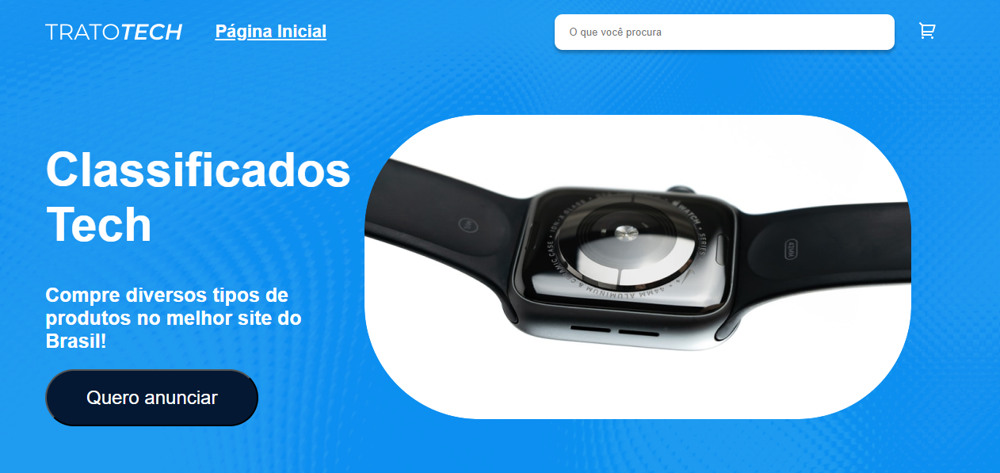
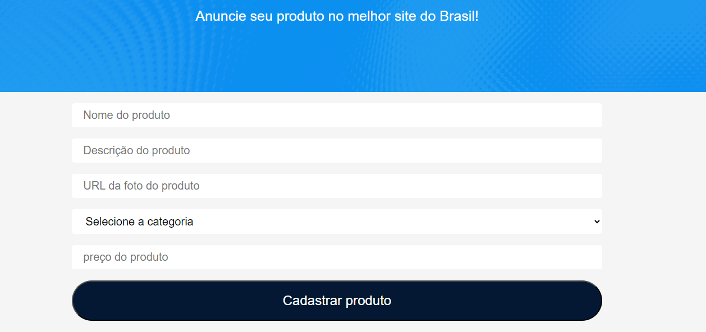

Este projeto foi feito em aula da Alura.  

  <a href="#-tecnologias">Tecnologias</a>&nbsp;&nbsp;&nbsp;|&nbsp;&nbsp;&nbsp;
  <a href="#-projeto">Projeto</a>

 

## 🤯 Demonstração

  

  

  

## 🚀 Tecnologias

Esse projeto foi desenvolvido com as seguintes tecnologias:

- React
- Redux-Toolkit
- Typescript
- SASS
- Chakra-Ui
- Axios
- Json-Server

## 💻 Projeto

O “Trato Tech” trata-se de um E-comerce simples desenvolvido em
React, com carrinho de vendas e busca

---

## 🤔 Instruções
### Primeiros passos:

Depois de baixar o arquivo no [GitHub](https://github.com/pdro-h0/trato-tech), no seu terminal, execute o seguinte comando na pasta raiz:

`npm install`

Após o primeiro passo, rode o comando no terminal para iniciar o servidor

`npm run server`

Por fim, rode o comando no terminal para iniciar o projeto:

`npm run dev`

---

Feito com ♥ by Pedro Henrique